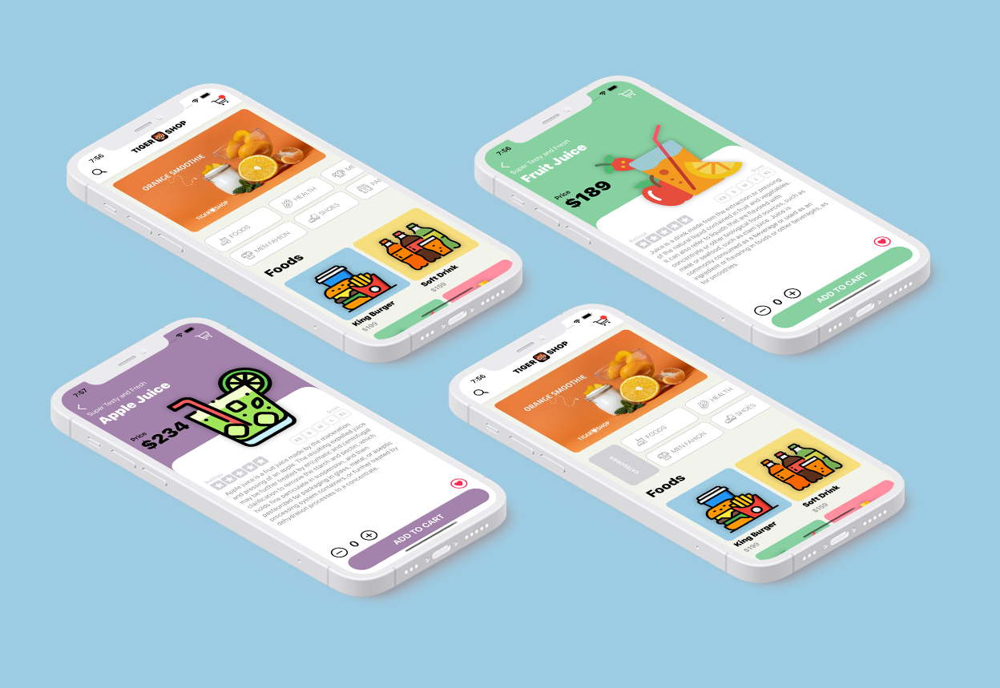

# Tiger Shop

Ecommerce iOS App using SwiftUI 2.0

It has Home Screen and Product Details screen ready. If you are an iOS Developer and love SwiftUI, then you are free to contribute in this project.

[](https://opensource.org/licenses/Apache-2.0)
[](https://github.com/shameemreza/tigershop/blob/main/LICENSE)

## Video Preview

[](https://www.youtube.com/watch?v=sxPHR7xRGso "Critter Clan IOS 14 App")

## Screenshots




## Features

- Nice UI and UX
- Works on: iOS, iPadOS
- Cool Animation
- JSON with Swift
- Horizontal Grid Layouts
- Custom Navigation bar
- Share the data model across the whole app
- Launch Screen
- Use of Environment Property Wrapper and Observable Object Property Wrapper
- Custom Shape with Shape Path
- Work with Constant System
- Tab Slider (Need to fix the tab View)


## License

```
Copyright 2021 Shameem Reza

Licensed under the Apache License, Version 2.0 (the "License");
you may not use this file except in compliance with the License.
You may obtain a copy of the License at

   http://www.apache.org/licenses/LICENSE-2.0

Unless required by applicable law or agreed to in writing, software
distributed under the License is distributed on an "AS IS" BASIS,
WITHOUT WARRANTIES OR CONDITIONS OF ANY KIND, either express or implied.
See the License for the specific language governing permissions and
limitations under the License.
```


